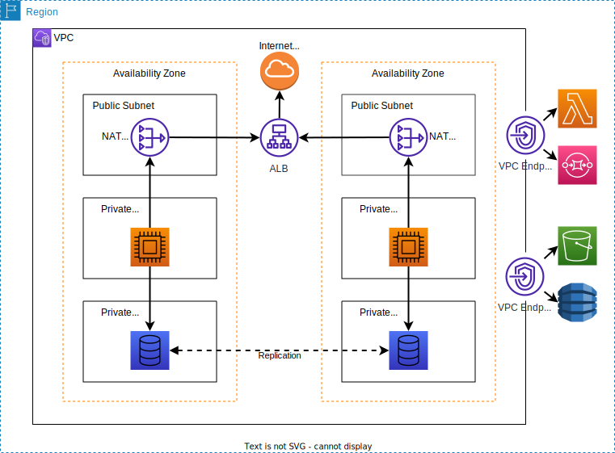

# AWS Networking Concepts and Overview

In general, most resources hosted in the AWS cloud should be isolated from the internet.  This is
accomplished using a Virtual Private Cloud, as well as associated Subnets, Route Tables and
Internet Gateways.

## Simple Well-Architected Application Example

*Simple application running in a VPC*

In the above figure, an application is deployed in two AZs for the purpose of resilience, with DB
replication between the AZs.  The application features a NAT gateway in the public subnets, and
compute and DB resources instance in their own private subnets.  Connection between compute and
DB instances in the same AZ is possible without additional resources.  The NAT gateway provides
access from the private subnets to the internet gateway, allowing the application to communicate
with the internet in a secure and controlled manner.

Additionally, a Gateway VPC Endpoint provides access from the
application to global AWS services, and an Interface VPC Endpoint provides access from the
application to regional AWS services.

## Virtual Private Clouds

VPCs isolate your resources from the internet completely. A resource
within a VPC cannot be reached from, or connect to, entities in the internet without configuring
an internet gateway.  Each VPC has a pool of private IP address which can be assigned to resources
in the cloud. At the time of VPC creation, it is necessary to allocate IP address via the CIDR block
definition. A VPC includes an implicit local router when it is created.

A VPC can be modeled very similarly to an on-prem network.  Two separate LANs would be equivilent
to two subnets in distinct AZs.  A switch (route table at the subnet level) connects hosts
(instances) within a single subnet, and a router (also a route table, but at the VPC level)
connects the two LANs.  An additional router (internet gateway) provides access from the two LANs
(the VPC) to the internet.

VPCs are scoped to specific AWS regions, but can span AZs.  VPCs can be connected using resources
provided by AWS for that purpose, such as peering or transit gateways.  Some resources deployed
within a VPC will operate across multiple AZs (for example, an elastic load balancer). Others,
such as EC2, must be assigned a specific AZs (via the subnet described below).  Still other
resources are fully managed by AWS and are not deployed within the VPC (such as S3 and SQS),
although they can be connected to it.

### VPC CIDR

To understand Classless Inter Domain Routing (CIDR), it is necessary to first understand how IP
address are represented in binary form.  IPv4 and IPv6 work essentially the same way, although IPv4
is much simpler to describe.  An IPv4 address is 32 bits long, broken into 4 octets.  It is possible
to translate an address into binary:

> **Example** 
> Given the IP address `192.168.56.212`, we have: 
>
> &nbsp;&nbsp;&nbsp;&nbsp;192 = 128 + 64 = 2^7 + 2^6 = 1 1 0 0 0 0 0 0 
> &nbsp;&nbsp;&nbsp;&nbsp;168 = 128 + 32 + 8 = 2^7 + 2^5 + 2^3 = 1 0 1 0 1 0 0 
> &nbsp;&nbsp;&nbsp;&nbsp;56 = 32 + 16 + 8 = 2^5 + 2^4 + 2^3 = 0 0 1 1 1 0 0 0 
> &nbsp;&nbsp;&nbsp;&nbsp;212 = 128 + 64 + 16 + 4 = 2^7 + 2^6 + 2^4 + 2^2
> = 1 1 0 1 0 1 0 0 
>
> So the binary address is `11000000.1010100.00111000.11010100`.

CIDR represents groups of IP addresses via an IP address and netmask. The IP address represents a
starting address for the block, while the netmask indicates which bits in the starting address can
be modified to provide a distinct value.

> **Example** 
> Given the CIDR block `192.168.0.0/16`: 
>
> - The initial address assigned to the block is 192.168.0.0
> - The first two octets (16 bits) are allocated to the network and cannot be modified, but the
> remaining octets can be modified and allocated to individual hosts
>
> Thus the address pool includes all addresses in the range `192.168.0.0` to `192.168.255.255`

> **Example** 
> Given the CIDR block `192.168.22.0/24`: 
>
> - The initial address is 192.168.22.0
> - The first 24 bits are allocated to the network, leaving 8 bits to allocate to individual hosts
>
> Thus the address pool includes all addresses in the range `192.168.22.0` to `192.168.22.255`

VPCs are limited to IPv4 address pools including netmasks in the range of `/16` to `/28`. Additionally
the address pool must include only private IPs as defined in RFC 1918:

- 10.0.0.0/8
- 172.16.0.0/12
- 192.168.0.0/16

IPv6 address pools use netmask `/56`, and the CIDR is controlled and allocated by AWS. IPv6 subnets
use netmask `/64`. Note that IPv6, all addresses are public by default and globally unique.

## Subnets

Subnets provide subsets of the overall IP pool available to the VPC.  Subnets are specific to
individual Availability Zones, however, each AZ can contain multiple subnets. As such, a subnet may
determine in which AZ a specific resource is deployed.
    - Private subnets cannot connect to the internet except through a Network Address Translation
    Gateway
    - Public subnets can connect directly to an internet gateway, and therefore to the internet

Subnets are defined by CIDR with the same restrictions as VPCs (netmask `/16` - `/28`).  Therefore, if
you create a VPC using netmask `/28`, you can only have a single subnet within it, as there is no
way to define a smaller block of addresses within the VPC address pool.

AWS reserves the first 4 and final IP address within each subnet, and these are not available for
assignment to resources:

- Address 1: network address (*ex.* 10.0.0.0 in 10.0.0.0/24)
- Address 2: VPC local router (*ex.* 10.0.0.1 in 10.0.0.0/24)
- Address 3: Maps to AWS-provided DNS service (*ex.* 10.0.0.2 in 10.0.0.0/24)
- Address 4: Reserved for future use (*ex.* 10.0.0.3 in 10.0.0.0/24)
- Last address: Network broadcast address, but this is not supported (*ex.* 10.0.0.255 in 
10.0.0.0/24)

## Route tables

Route tables define local routes between different resources within a VPC or subnet.  They operate in
a similar manner to an ethernet switch or router. Each route in the table specifies a `destination`
and a `target`:

| Destination | Target |
| :---: | :---: |
| 10.0.0.2 | ec2-instance-a |
| 10.0.0.3 | ec2-instance-b |

All VPCs include an implicit local router and a main route table when they are created.  This main
route table specifies a destination based on the VPC CIDR, and targets the local router.  Thus, a
resource in a subnet within a VPC can automatically communicate with a resource in another subnet
within the same VPC. However, an instance within the VPC cannot communicate with the internet
unless an entry is added to the route table which directs it to an internet gateway (and unless the
instance has a public IP address; more on that later).  Note that entries in the route table are
evaluated in order, so it is possible to go from *more specific* to *less specific* addresses in the
route table without problem:

| Destination | Target |
| :---: | :---: |
| 0.0.0.0/0 | Internet Gateway |
| 10.10.0.0/16 | Local |

The above works because, although the internet gateway receives traffic for any address, the second entry is more specific. This is known as "longest prefix match", and the result is that traffic
will be routed based on the route that has the most specific or limited range of IP addresses which
match it.

For a VPC with multiple subnets, if the desire is for subnet A to be able to reach the internet
and for subnet B to be isolated from it, then the main route table would not contain a record for
the internet gateway.  Instead, subnet A would have its own route table with an entry
for the internet gateway, while subnet B would use a route table without such a record, or would
use the main route table. Each subnet only follows a single route table, so a subnet-specific
route table takes precedence or the main route table.

Private subnets do not have an entry in their route table which provides access to an internet
gateway.  Public subnets do have such an entry.

Every route table contains default immutable local route for the VPC as a whole.  Also, it is rare,
but possible, to modify the main route table manually.

### IPv4 Addresses

Any resource in a subnet, automatically gets a private IP address.  It does this by connecting an
Elastic Network Interface to the instance, and the ENI receives the address via DHCP (although it is
possible to assign a specific address).  Usually this is not discussed because the ENI is implicit.
An instance can also receive a public IPv4 address assigned from the pool of public IPs.

If an instance is stopped, it gives up its public IP (as well as the private one, but that usually
doesn't matter).  When the instance is started up, it will receive a new public IP, which may be
problematic.

It is possible to assign an Elastic IP address to your instance.  This address remains allocated
until specifically released, so will re-attach to an instance when it is restarted.  An elastic IP
may also be mapped to a different instance.

### IPv6 Addresses

All IPv6 addresses are public and globally unique.  As such, when using IPv6 addresses in your VPC,
every resources that receives an IPv6 address automatically has a public address.  A VPC can operate
in dual-stack mode where VPC resources receive both IPv4 and IPv6 addresses.  When an instance is
stopped, the IPv6 address persists.

## Firewalls

While routing provides information about how to send packets from one address to another, firewalls
determine whether the packets are permitted to make the trip. Within a VPC, access is controlled
first by the Network ACL, which limits access to a specific subnet, and the security group, which
limits access to the specific instance.

### Security Groups

Security groups operate at the instance or ENI level, and only permit certain kinds of traffic from
specific addresses to specific ports to be routed to the desired targets.  Security groups have
*ingress* and *egress* rules.  Access isdetermined by a combination of factors:

- Protocol
- Target port range (or source port for egress rules)
- Origin IP address (or destination address for egress rules)

Security groups do not permit DENY rules, only ALLOW.  Anything not specifically allowed is blocked.
Note that a security group evaluates *all* rules before permitting trafffic.

Security groups are *stateful*.  This means that if an inbound request is allowed by an ingress
rule, than a reply to the request will also be allowed without checking the egress rules.
Similarly, if an outbound request is allowed by the egress rules, than the corresponding inbound
response will also be allowed without checking the ingress rules.

Security group rules can reference other security groups.  For example, if an autoscaling group in
one security group need to connect to an instance in another security group, it is not practical
to specify the origin IPs because they will change each time an autoscaling event occurs.  Instead,
the rule can reference the security group ID as a valid source.

Each account has one or more default security groups.  This group attaches to new EC2 instances
which do not already have a security group assigned. The inbound rule specifies that all traffic
*within* the default security group is allowed (all instances in the group can communicate with
eachother). However, no traffic from outside the group is permitted.  The group's egress rule
permits all traffic to all destinations.

### Network ACL

Network ACLs reside at the subnet level, and contains both ALLOW and DENY rules.  Rules are numbered
and evaluated in order from smallest rule to largest. Best practice is to number the rules in
increments of 100.  NACLs are stateless, unlike security groups.  The default NACL allows all
inbound and outbound traffic.  NACLs are a great way of blocking known malicious IP addresses.

## Internet Gateways

Internet gateways provide access to the internet for resources in a VPC.  Only those resources
within a VPC which have a public-facing IP address can access the internet through the gateway. The
internet gateway also provides a target for incoming traffic to the VPC, and can provide NAT
services as needed.

## Additional Networking Resources

### Private Link

Private Link provides access to region-specific AWS services from within your VPC. It can also
provide access to applications deployed in other VPCs (even across accounts and regions) without
requiring your application to do so via the internet.

### Peering Connections

Peering connections provide 1:1 access between machines in two different VPCs.

### Transit Gateway

A transit gateway permits connections among numerous different VPCs and with on-premises resources.
For example, if your
organization has numerous VPCs, communication between them could potentially require thousands
of 1:1 private link or peering connections.  Transit Gateway acts like a hub, allowing all of your
VPCs to connect to a single gateway, enable communication amongst all of them.

### IPSecVpn

IPSecVpn provides an alternative means of connecting to on-premises services which can be 
significantly simpler and cheaper than Transit Gateway.  However, this connection passes over the
internet and is subject to bandwidth limitations and internet outages

### DirectConnect

DC provides a direct physical connection between on-premises services and a VPC.

### Client VPN

Client VPNs permit connection between remote users and your VPC.

